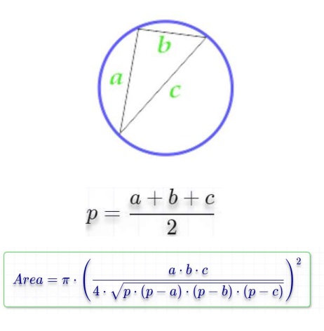

Write a program to calculate circle area circle described around an arbitrary triangle,
then print it on the screen.
The use should enter:
a
b
C
Example Inputs:
5
6
7
Outputs 
40.088
Step 1: Ask the user to enter his/her age.
Step 2: Ask the user if s\he has a diver license.
Step 3: Result = (Age > 21 and HasDriverLicense=True).
Step 4: check if result =True then Hire otherwise Reject..
Step 5: Print “Hired” or “Rejected” accordingly
